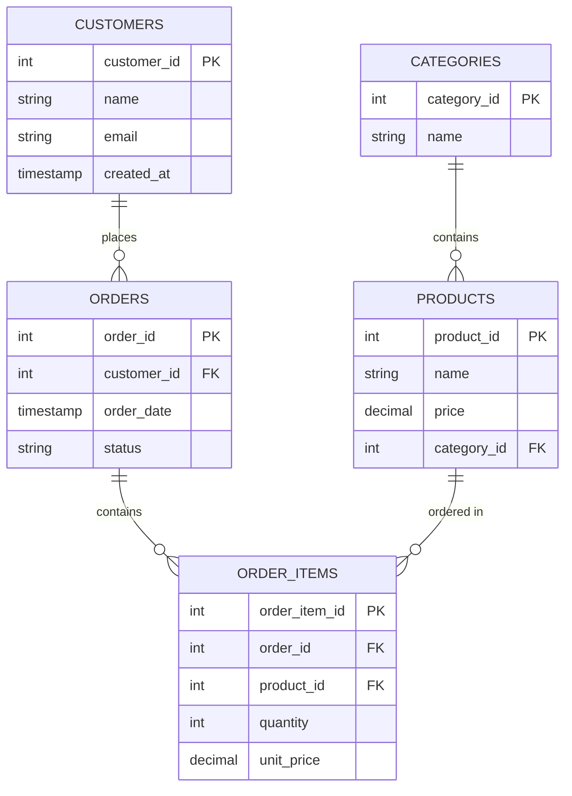

# Day 7 — E-commerce Schema Design (MySQL)

## What this is

A 5-table e-commerce schema, run for real against MySQL 8 in a Docker
container, covering customers, product categories, products, orders, and
order line items.

## ER diagram

## Design decisions

- order_items is a junction table. An order can contain many products and a
  product can appear in many orders - a many-to-many relationship, which a
  plain foreign key can't express directly. order_items sits between orders
  and products with a foreign key to each, turning it into two ordinary
  one-to-many relationships.
- unit_price is stored on order_items as a snapshot, not looked up live from
  products.price. If a product's price changes later, past orders must
  still show what the customer actually paid at the time, not today's price.
- status on orders uses ENUM('pending','shipped','delivered','cancelled')
  rather than a plain VARCHAR, so MySQL rejects an invalid or typo'd status
  outright instead of silently accepting bad data.
- price and unit_price use DECIMAL(10,2), not FLOAT/DOUBLE, to avoid
  floating-point rounding errors in money values.

## Verified, not assumed

- Inserted one real customer, category, product, order, and order item, and
  confirmed a join across all 5 tables returns the correct connected row.
- Deliberately tried inserting an order for a non-existent customer_id and
  confirmed MySQL rejected it with a real foreign key constraint error
  (1452), proving referential integrity is actually enforced by the
  database, not just implied by the CREATE TABLE statements.

## Files

- schema.sql - the exported table structure (mysqldump --no-data), no rows
- README.md - this file

## How to run

docker run --name ecommerce-mysql -e MYSQL_ROOT_PASSWORD=devpassword -p 3306:3306 -d mysql:8
docker exec -i ecommerce-mysql mysql -uroot -pdevpassword -e "CREATE DATABASE ecommerce;"
docker exec -i ecommerce-mysql mysql -uroot -pdevpassword ecommerce < schema.sql
