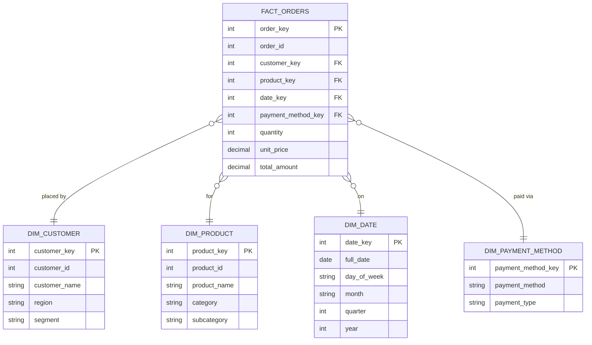

# Star Schema — E-Commerce Orders

One fact table at the center, surrounded by dimension tables that each
describe one aspect of an order. This is the dimensional-modelling
counterpart to Day 7's normalized 5-table MySQL schema: instead of
minimizing redundancy, a star schema deliberately denormalizes each
dimension into one wide, flat table so analytical queries (like Day 13's
rolling revenue and top-customer queries) can run with simple joins
instead of long normalized join chains.

